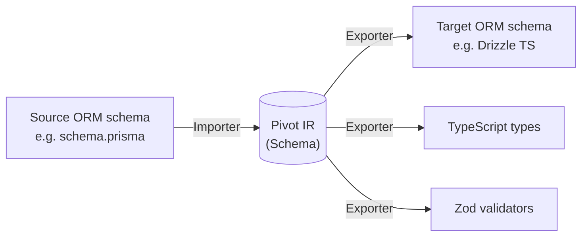
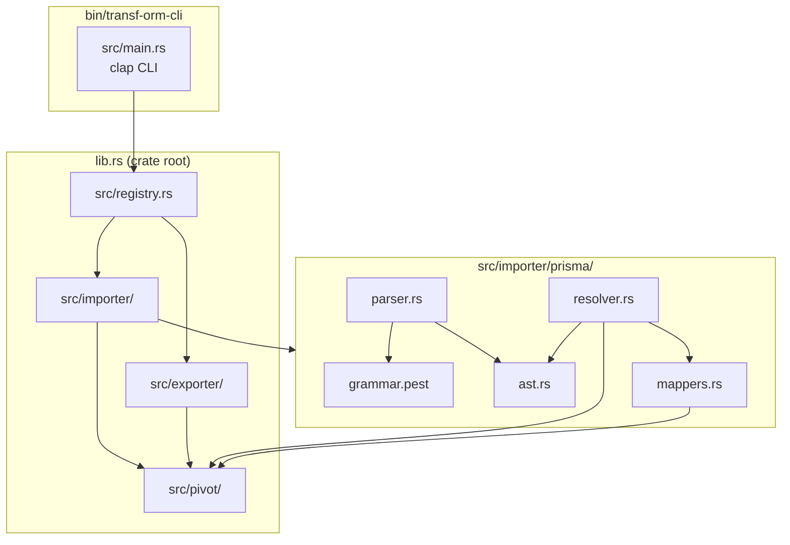
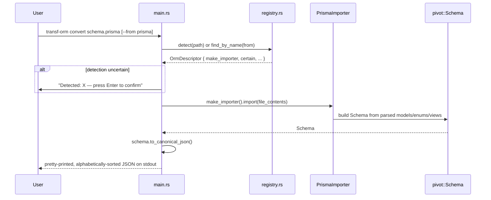

# Architecture

Transf-ORM-CLI converts ORM schemas into a universal intermediate representation (the
**Pivot IR**) and back out to other ORM formats, avoiding an N×M conversion matrix between
every pair of supported ORMs.

Instead of writing a Prisma→Drizzle converter, a Drizzle→TypeORM converter, etc.
(N×M implementations), every ORM gets exactly one importer and one exporter (N+M
implementations), all routed through the same `Schema` type. See
[`pivot-ir.md`](pivot-ir.md) for the full design of that type.

## The six planned layers

The project is designed around six layers. Only some are implemented today.

| # | Layer | Status | Location |
|---|---|---|---|
| 1 | **Pivot** — the universal IR | ✅ Implemented | `src/pivot/` |
| 2 | **Importers** — ORM schema → Pivot | 🚧 Prisma only | `src/importer/` |
| 3 | **Exporters** — Pivot → ORM schema / SQL / TS / Zod | 🚧 Trait only, no implementations | `src/exporter/` |
| 4 | **Codemods** — rewrite ORM call sites in user code | ❌ Not started | — |
| 5 | **Versioning** — diff/merge/history/rollback for pivot schemas | ❌ Not started | — |
| 6 | **CLI** — `convert`, `generate`, `diff`, `merge`, `validate`, `init`, `watch`, `history` | 🚧 `convert` only | `src/main.rs` |

The codemod layer (5) is expected to be the most technically complex: it requires parsing
TypeScript/JavaScript source, detecting ORM-specific call patterns
(`prisma.user.findMany(...)`), and rewriting them to the target ORM's API.

## Module graph (as implemented)

- **`src/lib.rs`** just re-exports the four top-level modules (`pivot`, `importer`,
  `exporter`, `registry`) so the binary crate (`main.rs`) and integration tests can use them.
- **`src/registry.rs`** is the single place that knows which ORMs the tool supports — see
  [`cli.md`](cli.md).
- **`src/importer/`** defines the `Importer` trait; today its only implementation is
  `prisma/` — see [`importers.md`](importers.md).
- **`src/exporter/`** defines the `Exporter` trait (`export(&self, schema: &Schema) ->
  Result<String, ExportError>`) but has zero implementations yet.

## Request flow: `transf-orm convert schema.prisma`

## Pivot design principle

The pivot always represents the **semantic intent** of a schema, not one ORM's SQL
implementation of it. Two ORMs that model the same relationship differently at the SQL
level (e.g. inline `REFERENCES` vs. a separate `ALTER TABLE ... ADD CONSTRAINT`) still
produce the same `Relation` + `ForeignKey` pair in the pivot. Exporters are responsible for
emitting whatever SQL/DSL is idiomatic for their target ORM.

Adding a new importer or exporter must never require changing the pivot types themselves —
new ORM-specific data that has no IR equivalent goes into `OrmMetadata.unknown_features`
(see [`pivot-ir.md`](pivot-ir.md#ormmetadata--the-escape-hatch)) instead.
