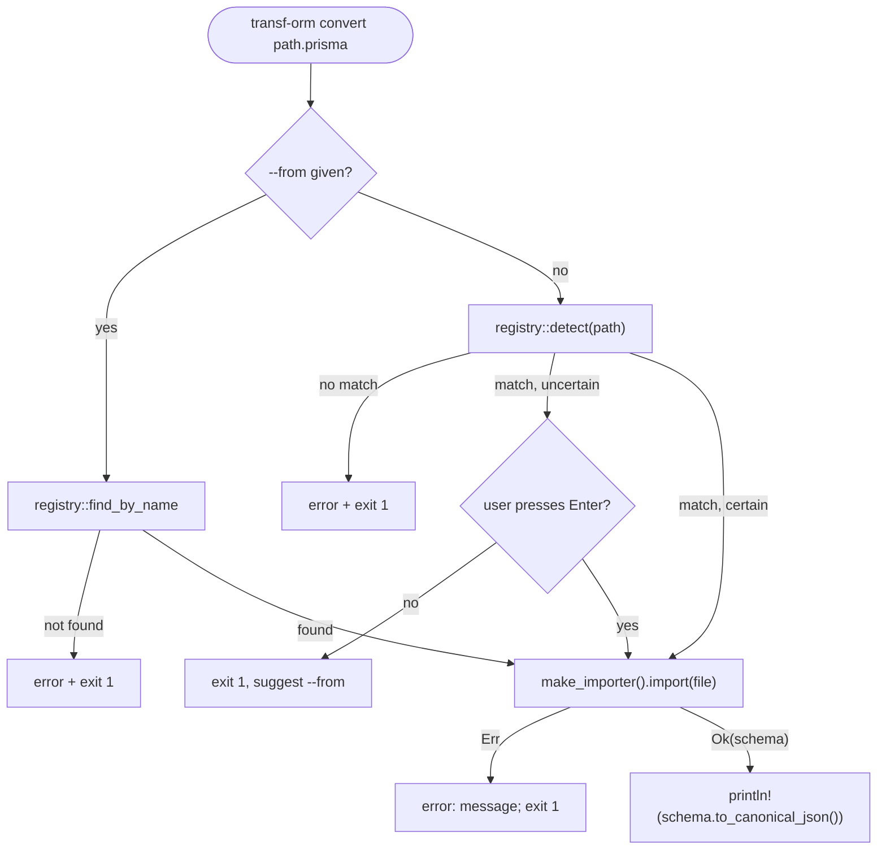

# CLI

The CLI (`src/main.rs`) is built with `clap`'s derive API. Today it exposes a single
subcommand.

## `transf-orm convert`

```bash
transf-orm convert <path> [--from <orm>]
```

- `<path>` — path to the schema file (e.g. `schema.prisma`).
- `--from <orm>` — force the source ORM by CLI name, skipping detection. Valid values come
  from `registry::names()`.

Behavior:

1. If `--from` is given, look up the ORM by name via `registry::find_by_name`. Unknown
   names print the list of valid options and exit with status 1.
2. Otherwise, call `registry::detect(path)`, which matches the file extension against every
   registered `OrmDescriptor`. No match prints an error suggesting `--from` and exits.
3. If the detected ORM is not `certain` (extension is ambiguous between multiple ORMs),
   the CLI prompts for an Enter-to-confirm before proceeding; any other input (or Ctrl+C)
   aborts.
4. Reads the file, calls the ORM's `make_importer().import(content)`.
5. On success, prints `schema.to_canonical_json()` to stdout (pretty JSON, alphabetically
   sorted keys — see [`pivot-ir.md`](pivot-ir.md#serialization-canonical-json)).
6. On `ImportError`, prints `error: <message>` to stderr and exits with status 1.



Currently the only registered ORM is Prisma, so `--from` is rarely needed in practice —
`.prisma` extension detection is `certain: true`, so no confirmation prompt occurs either.

## Registry

`src/registry.rs` is the single source of truth for which ORMs the CLI knows about:

```rust
pub struct OrmDescriptor {
    pub name: &'static str,                                  // CLI name for --from/--to
    pub display_name: &'static str,                          // human-readable
    pub extensions: &'static [&'static str],                 // e.g. &["prisma"]
    pub certain: bool,                                        // true = extension is unambiguous
    pub make_importer: Option<fn() -> Box<dyn Importer>>,
    pub make_exporter: Option<fn() -> Box<dyn Exporter>>,
}

pub static ORMS: &[OrmDescriptor] = &[OrmDescriptor {
    name: "prisma",
    display_name: "Prisma",
    extensions: &["prisma"],
    certain: true,
    make_importer: Some(|| Box::new(PrismaImporter)),
    make_exporter: None,
}];
```

Helper functions:

- `detect(path) -> Option<&OrmDescriptor>` — matches the path's file extension.
- `find_by_name(name) -> Option<&OrmDescriptor>` — case-insensitive lookup by CLI name.
- `names() -> Vec<&str>` — all registered CLI names, used for error messages.

**Adding a new ORM to the CLI is exactly one new entry in `ORMS`** — nothing else in
`main.rs` needs to change. `make_importer`/`make_exporter` are `Option` so an ORM can be
import-only, export-only, or (eventually) both; today every entry has `make_exporter:
None` since no exporter exists yet (see [`importers.md`](importers.md#exporters)).

## Planned commands

Per the root [`CLAUDE.md`](../CLAUDE.md) and [`architecture.md`](architecture.md), the CLI
is expected to grow `generate`, `diff`, `merge`, `validate`, `init`, `watch`, and `history`
subcommands as the exporter, versioning, and codemod layers are implemented. None of these
exist in `src/main.rs` yet.
