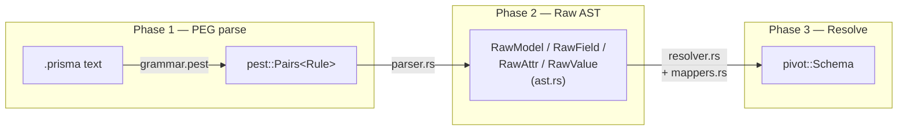

# Importers

An importer turns a source ORM's schema text into a [`pivot::Schema`](pivot-ir.md). Every
importer implements the same trait, defined in `src/importer/mod.rs`:

```rust
pub trait Importer {
    fn import(&self, input: &str) -> Result<Schema, ImportError>;
}

pub enum ImportError {
    Parse(String),   // input could not be parsed at all
    Schema(String),  // parsed, but semantically invalid (e.g. unknown type reference)
}
```

Today `prisma/` is the only implementation (`src/importer/prisma/`, exposing
`PrismaImporter`). It is registered in [`src/registry.rs`](cli.md#registry) alongside its
file extension (`.prisma`) so the CLI can auto-detect it.

## The Prisma importer pipeline



| File | Role |
|---|---|
| `grammar.pest` | The PEG grammar for Prisma Schema Language — defines `schema`, `block` (`datasource`/`generator`/`model`/`enum`/`view`/`type` alias), `field_decl`, attribute syntax (`@id`, `@@map(...)`), and value literals. |
| `ast.rs` | The **raw, untyped** intermediate structs the parser produces: `RawAttr { path, args }`, `RawArg::{Named, Positional}`, `RawValue::{Str, Int, Float, Ident, Array, Call}`, `RawField`, `RawModel`, `RawTypeAlias`. These are `pub(super)` — never exposed outside the `prisma` module. |
| `parser.rs` | Walks `pest::Pairs<Rule>` and builds the `ast.rs` structures. Exposes `PrismaParser` (the pest-generated parser struct), `extract_database_kind`, `parse_model_block`, `parse_type_alias`, `parse_attribute`, `parse_enum_block`. This stage only understands *syntax* — it has no notion yet of what `String` or `@db.VarChar(255)` mean semantically. |
| `resolver.rs` | Turns the raw AST into pivot types. `resolve_models` builds `Table`s (columns, primary keys, indexes, foreign keys, relations, inheritance, behaviors) from `RawModel`s, cross-referencing model and enum names to distinguish scalar fields from relation fields and to detect implicit many-to-many relations. `resolve_views` does the analogous work for `view` blocks. Unrecognized attributes are routed into `OrmMetadata.unknown_features` here (via a shared `push_unknown_attrs` helper) rather than dropped. |
| `mappers.rs` | Small, focused translation functions used by `resolver.rs`: `map_scalar_type` (Prisma type name → `ScalarType`), `map_db_hint` (`@db.*` attribute → `DbHint`), `map_default_value` (`@default(...)` → `DefaultValue`), `map_index_type`, `extract_index_columns`, `parse_referential_action`, plus `raw_value_to_json`/`raw_args_to_json` used to serialize unrecognized attribute arguments into `UnknownFeature.value`. |

The entry point tying all three phases together is `parse_schema` in `mod.rs`:

```rust
pub fn parse_schema(input: &str) -> Result<Schema, ImportError> {
    let pairs = PrismaParser::parse(Rule::schema, input)?;   // Phase 1
    // ...walk top-level blocks, collecting RawModel/RawView/Enum/RawTypeAlias...   Phase 2
    let tables = resolver::resolve_models(raw_models, &model_names, &enum_names, &type_aliases)?; // Phase 3
    let views  = resolver::resolve_views(raw_views, &enum_names, &type_aliases)?;
    // ...assemble into a Schema
}
```

`PrismaImporter::import` (the `Importer` trait impl) just delegates to `parse_schema`.

### Design choices worth knowing

- **Type aliases are inlined, not preserved as a separate concept.** Prisma's `type Foo =
  Int @id @default(autoincrement())` has no equivalent pivot type — `resolver.rs` expands
  each use of `Foo` back to its underlying `ScalarType` + attributes at resolve time, so
  the alias is invisible to the rest of the pipeline.
- **Unrecognized attributes never cause a hard error.** Any `@` or `@@` attribute the
  resolver doesn't have an explicit case for is captured as an `OrmMetadata.unknown_features`
  entry (namespaced `"prisma.<name>"`) instead of being dropped or aborting the import
  — see [`pivot-ir.md`](pivot-ir.md#ormmetadata--the-escape-hatch). This is what lets the
  importer stay lossless against future Prisma releases without being updated for every
  new attribute immediately.
- **Views are parsed but their SQL definition is not available.** Prisma Schema Language's
  `view` blocks only declare the column list, not the underlying `SELECT` — so
  `View.definition` is always an empty string for Prisma-sourced views.

## Adding a new importer

Following the pattern above:

1. Create a new module under `src/importer/<orm_name>/` and implement the `Importer` trait
   on a zero-sized (or config-holding) struct, mirroring `PrismaImporter`.
2. Keep any parser-specific intermediate representation (your equivalent of `ast.rs`)
   private to your module (`pub(super)`), and only ever construct/return `pivot::Schema` at
   the boundary.
3. **Never mutate pivot types from within the importer.** If the source ORM has a feature
   with no IR equivalent, add it to `OrmMetadata.unknown_features` rather than proposing a
   pivot change from inside the importer — pivot changes are cross-cutting and must keep
   every importer/exporter consistent (see the root [`CLAUDE.md`](../CLAUDE.md)).
4. Register the ORM in `src/registry.rs`'s `ORMS` slice with its file extension(s) and a
   `make_importer` factory — see [`cli.md`](cli.md#registry) for the exact shape.
5. Add tests following the existing `src/importer/prisma/mod.rs` style: focused unit tests
   per feature, plus one comprehensive test parsing a realistic multi-table fixture (see
   `test.prisma` at the repo root and the `parse_full_test_schema` test) and asserting a
   full JSON round-trip.

## Exporters

`src/exporter/mod.rs` defines the mirror-image trait, with no implementations yet:

```rust
pub trait Exporter {
    fn export(&self, schema: &Schema) -> Result<String, ExportError>;
}

pub enum ExportError {
    Unsupported(String), // the schema contains a construct with no target-ORM equivalent
    Render(String),      // serialization failed for an internal reason
}
```

When the first exporter is implemented, it will be registered the same way as an importer
— via `make_exporter` in the relevant `OrmDescriptor` in `src/registry.rs`.
