# The Pivot IR

The Pivot IR (`src/pivot/`) is the universal intermediate representation at the heart of
Transf-ORM. Every importer parses a source ORM schema into a `Schema`; every exporter
consumes a `Schema` and emits a target ORM schema or artifact (SQL DDL, TypeScript types,
Zod validators, ...).

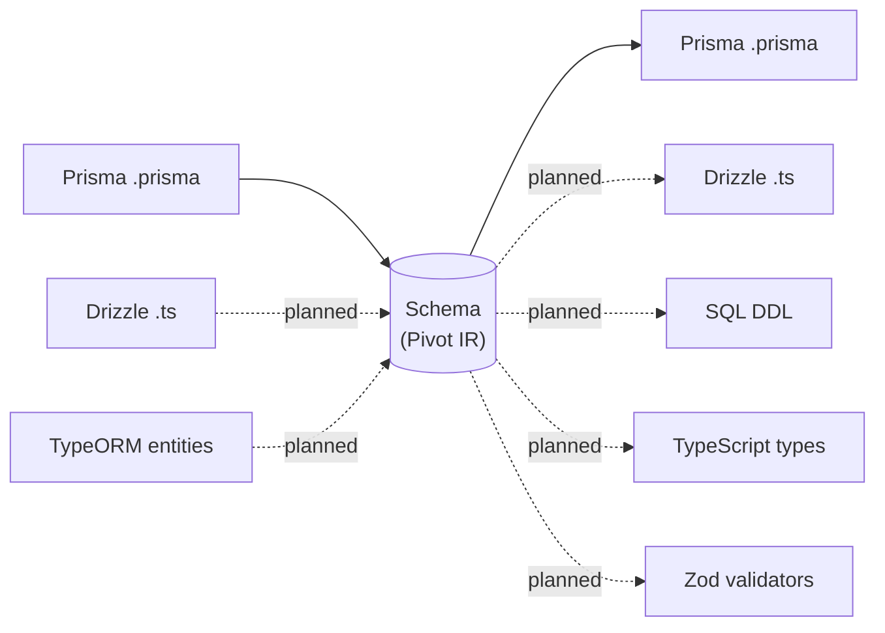

Without a pivot, supporting N ORMs bidirectionally requires N×(N-1) converters. With a
pivot, it requires N importers + N exporters. This is why the pivot must be a **semantic
superset** capable of representing anything any supported ORM can express — including
features that don't yet have first-class IR support (see
[`OrmMetadata`](#ormmetadata--the-escape-hatch)).

All source code referenced below lives in `src/pivot/{mod,table,relation,types,metadata,procedure,view}.rs`.

## Two layers on one structure

Every `Table` mixes two conceptually distinct layers:

- **DB layer** — everything that exists in the database DDL regardless of ORM: columns,
  primary key, indexes, unique/check constraints, foreign keys.
- **ORM layer** — abstractions an ORM adds on top of the DDL: relations, behaviors,
  inheritance, ORM-specific metadata.

```mermaid
flowchart TB
    subgraph Table["Table (src/pivot/table.rs)"]
        direction TB
        subgraph DB["DB layer — exists in the database"]
            columns[columns: Column&#91;&#93;]
            pk[primary_key: Option&lt;PrimaryKey&gt;]
            idx[indexes: Index&#91;&#93;]
            uniq[unique_constraints: UniqueConstraint&#91;&#93;]
            chk[check_constraints: CheckConstraint&#91;&#93;]
            fk[foreign_keys: ForeignKey&#91;&#93;]
        end
        subgraph ORM["ORM layer — added by the framework"]
            rel[relations: Relation&#91;&#93;]
            inh[inheritance: Option&lt;Inheritance&gt;]
            beh[behaviors: Behavior&#91;&#93;]
            meta[metadata: OrmMetadata]
        end
    end
```

A `ForeignKey` and a `Relation` can describe the "same" real-world connection between two
tables, but they are kept separate: some ORMs (Drizzle, MikroORM) declare relations
independently of the database schema, while others (Prisma, TypeORM) derive both from a
single model declaration. Keeping them as distinct IR nodes means both layers survive a
round-trip regardless of which style the source ORM uses.

## `Schema` — the root type

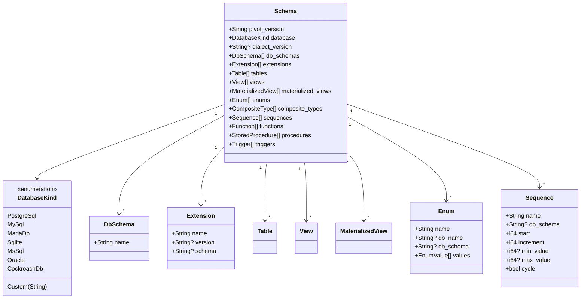

`Schema::new(database)` builds an empty schema with `pivot_version = "1.0.0"` and every
collection empty — importers populate it field by field. `DbSchema` models PostgreSQL
schemas or MySQL databases as named namespaces; `Extension` models things like
`uuid-ossp`, `postgis`, `pgcrypto`; `Sequence` models the auto-increment generator behind
`SERIAL`/`BIGSERIAL` or an explicit `NEXTVAL` reference. `CompositeType` (PostgreSQL
composite types) is a named record type made of `CompositeTypeField { name, field_type:
ColumnType }` entries, reusable as a column type, function parameter, or return type.

## `Table` and its parts

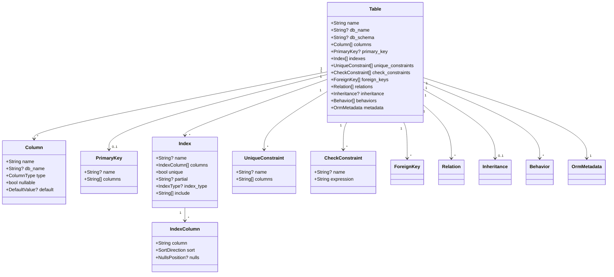

`name`/`db_name` and `db_schema` recur throughout the IR (also on `View`, `Enum`,
`Sequence`, ...): `name` is the logical, ORM-facing identifier; `db_name` is set only when
the actual database name differs (Prisma `@map`/`@@map`); `db_schema` is the owning
PostgreSQL schema or MySQL database.

`Index.index_type` covers `BTree` (default), `Hash`, and the PostgreSQL-specific `Gin`,
`Gist`, `Brin`, `SpGist`, plus `Custom { name }` for engine-specific access methods (the
Prisma importer uses this for `@@fulltext`, encoding it as `IndexType::Custom { name:
"fulltext" }`). `Index.include` models PostgreSQL covering indexes (`INCLUDE (...)`).

### `Behavior` and `Inheritance`

Common ORM patterns are modeled as first-class IR concepts instead of being buried in
`OrmMetadata`, so exporters can map them to the right target-ORM annotation without
parsing raw metadata:

| `Behavior` variant | Fields | Example target mapping |
|---|---|---|
| `SoftDelete` | `column: String` | a `deletedAt`-style column marking logical deletion |
| `CreatedAt` | `column: String` | TypeORM `@CreateDateColumn`, Drizzle `default: sql\`now()\`` |
| `UpdatedAt` | `column: String` | Prisma `@updatedAt` |
| `Versioning` | `column: String` | optimistic-locking version column |

| `Inheritance` strategy | Fields | Meaning |
|---|---|---|
| `SingleTable` | `discriminator_column: String`, `discriminator_value: Option<String>` | all subclass columns share one table, discriminated by a column value |
| `TablePerClass` | `parent_table: Option<String>` | each concrete class gets its own table with all inherited columns |
| `ConcreteTable` | `parent_table: Option<String>` | like `TablePerClass`, but abstract classes also get a table |

## Column types: `ScalarType` + `DbHint`

A column's type is not one flat enum — it is a **scalar kind** plus an **optional
database-specific hint**, because collapsing them would be lossy.

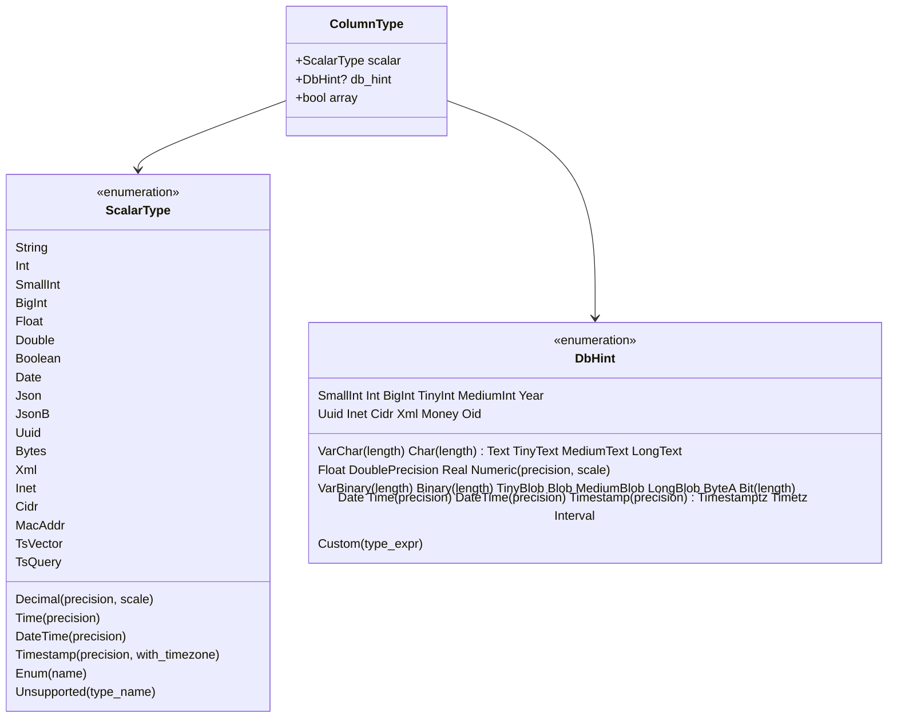

Example — Prisma `email String @db.VarChar(255)`:

```rust
ColumnType {
    scalar: ScalarType::String,
    db_hint: Some(DbHint::VarChar { length: 255 }),
    array: false,
}
```

Without the hint, an exporter would only know "this is a string" and would have to guess a
column width — most likely falling back to `TEXT` and silently dropping the length
constraint the original schema enforced. `ColumnType::simple(scalar)` is a shorthand
constructor for the common case of no hint and no array wrapper. `array: true` models
PostgreSQL array columns (`INT[]`); the Prisma importer sets it whenever a scalar field
uses the `[]` type modifier (`tags String[]`).

`ScalarType::Enum { name }` references a named `Enum` defined elsewhere in the same
`Schema` (by name, not by embedding it) — see `Schema.enums`.
`ScalarType::Unsupported { type_name }` is the per-column escape hatch: a raw database
type with no IR equivalent, preserved verbatim so a round-trip back to the source ORM
doesn't lose it. The Prisma importer produces this for e.g. `Unsupported("hstore")`.

## Default values: why `AutoIncrement` is not a type

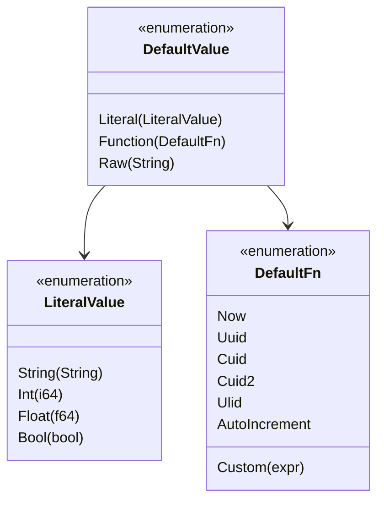

Prisma expresses auto-increment as `@default(autoincrement())` (a default value), while
Drizzle expresses it as `serial()` (a type constructor). To unify these two ORMs' mental
models at the IR level, `AutoIncrement` is encoded as a `DefaultFn` variant — i.e. always
as a `Column.default`, never as part of `ScalarType`. `DefaultValue::Raw(String)` is the
escape hatch for arbitrary SQL default expressions the IR can't otherwise model (e.g.
`gen_random_uuid()`).

## Relations

`ForeignKey` (DB layer, in `Table.foreign_keys`) and `Relation` (ORM layer, in
`Table.relations`) are deliberately separate types — see [Two layers on one
structure](#two-layers-on-one-structure).

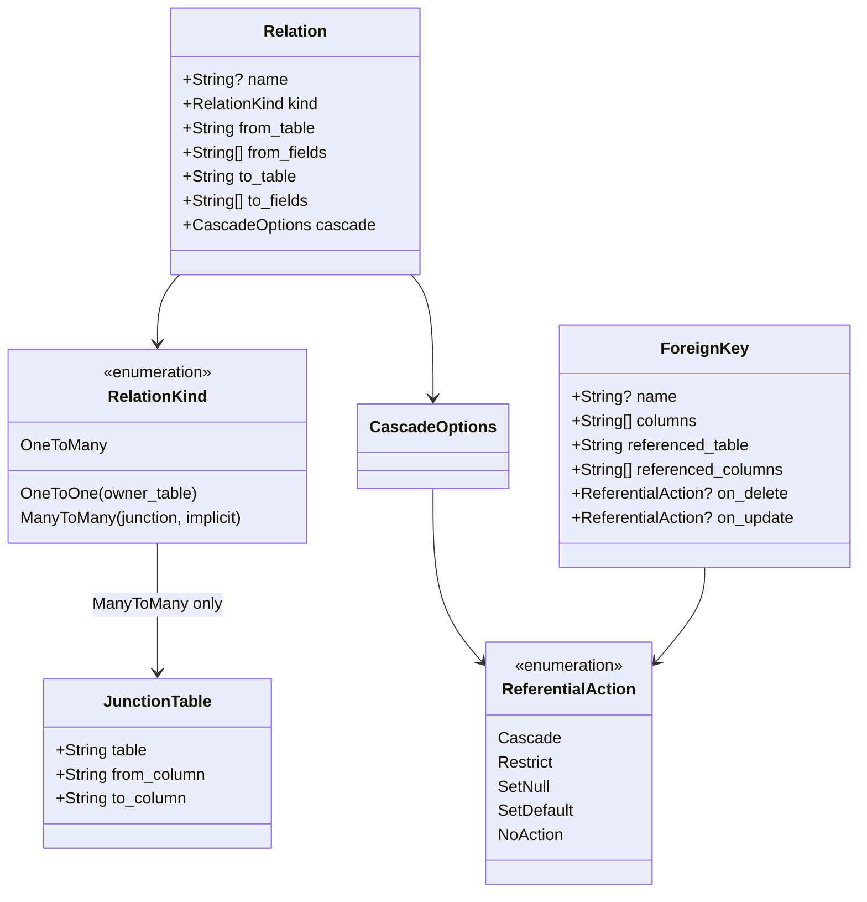

`RelationKind::OneToOne { owner_table }` records which side physically holds the foreign
key column, since a 1:1 relation is symmetric in the model but not in the database.
`RelationKind::ManyToMany { junction, implicit }` always carries a populated
`JunctionTable`, **even when `implicit = true`** — this is what lets a round-trip back to
Prisma reconstruct the original implicit `@relation` without the user ever having declared
the junction table themselves.

### Worked example: Prisma implicit many-to-many

Given (from the test fixture in `src/importer/prisma/mod.rs`):

```prisma
model Post {
  id   Int   @id @default(autoincrement())
  tags Tag[]
}
model Tag {
  id    Int    @id @default(autoincrement())
  posts Post[]
}
```

Prisma manages the join table `_PostToTag` invisibly. The pivot still represents it
explicitly:

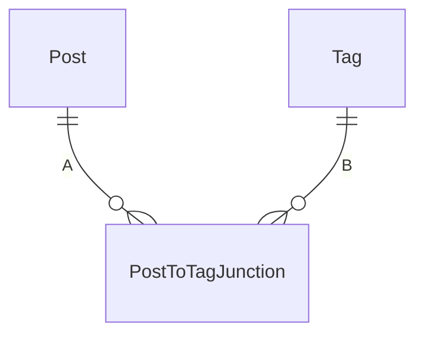

`PostToTagJunction` above stands in for the real junction table name, `_PostToTag`
(mermaid ER diagram entity names can't start with `_`); every other identifier in this
document is a literal, exact name from the code.

```rust
Relation {
    name: Some("PostToTag".to_string()),
    kind: RelationKind::ManyToMany {
        junction: JunctionTable {
            table: "_PostToTag".to_string(),
            from_column: "A".to_string(),
            to_column: "B".to_string(),
        },
        implicit: true,   // Prisma manages this table; it does not appear in Schema.tables
    },
    from_table: "Post".to_string(),
    from_fields: vec!["id".to_string()],
    to_table: "Tag".to_string(),
    to_fields: vec!["id".to_string()],
    cascade: CascadeOptions { on_delete: None, on_update: None },
}
```

This exact shape is asserted by the `many_to_many_implicit_preserves_junction` and
`implicit_m2m_post_tag` tests. If `implicit` were `false`, the junction table would
instead be a regular entry in `Schema.tables` (an explicit join model the user wrote
themselves).

## `OrmMetadata` — the escape hatch

No IR can anticipate every feature of every ORM. Rather than silently dropping unknown
constructs (breaking round-trips) or refusing to convert (breaking usability),
`OrmMetadata` — attached to `Table`, `View`, and `MaterializedView` — stores them:

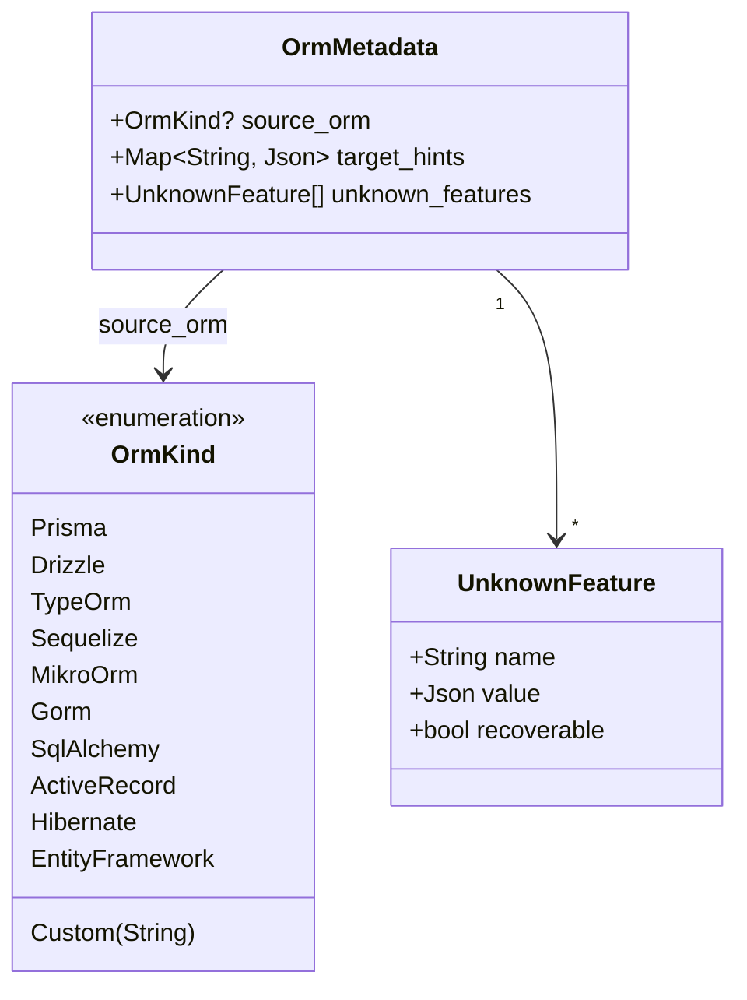

- **`source_orm`** — which ORM this table/view was originally parsed from.
- **`target_hints`** — a `BTreeMap<String, Value>` keyed by a serialized `OrmKind`,
  letting an importer embed hints for a specific *target* ORM without coupling the IR
  itself to that ORM.
- **`unknown_features`** — a list of `{ name, value, recoverable }` triples for source-ORM
  features with no IR equivalent. `recoverable: true` means the feature can be restored
  when converting back to the source ORM; `false` means it's preserved for inspection only.

The Prisma importer uses this extensively and namespaces keys as `"prisma.<feature>"`. Real
examples from its test suite:

| Prisma source | `UnknownFeature.name` | `value` |
|---|---|---|
| `@@ignore` on a model | `"prisma.ignore"` | `true` |
| `@ignore` on a field `secret` | `"prisma.ignoredFields"` | `["secret"]` |
| `@omit` on a field `email` | `"prisma.field.email.omit"` | `true` |
| Unrecognized block attribute `@@shardKey([id])` | `"prisma.shardKey"` | the raw args as JSON |

The last row matters beyond Prisma specifically: **any** `@@`/`@` attribute the importer
doesn't explicitly handle is preserved this way rather than silently dropped, so future
Prisma releases (or custom generator plugins) don't cause silent data loss.

## Procedures, functions, and triggers

Functions and stored procedures are first-class IR nodes because ORMs increasingly call
them directly (Prisma `queryRaw`, TypeORM query builder raw calls).

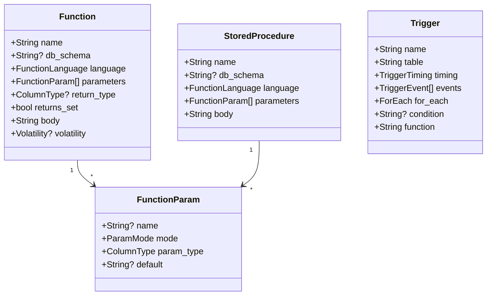

`Function` differs from `StoredProcedure` in that it returns a value (`return_type`,
`returns_set` for `SETOF`) and carries a `Volatility` hint (`Volatile`/`Stable`/
`Immutable`) that affects query planning; `StoredProcedure` (PostgreSQL 11+) is invoked
with `CALL`, never returns a value, and may control transactions in its body. `Trigger`
ties a `TriggerTiming` (`Before`/`After`/`InsteadOf`) and one or more `TriggerEvent`s
(`Insert`/`Update`/`Delete`/`Truncate`) on a table to a named database `function`.

## Views

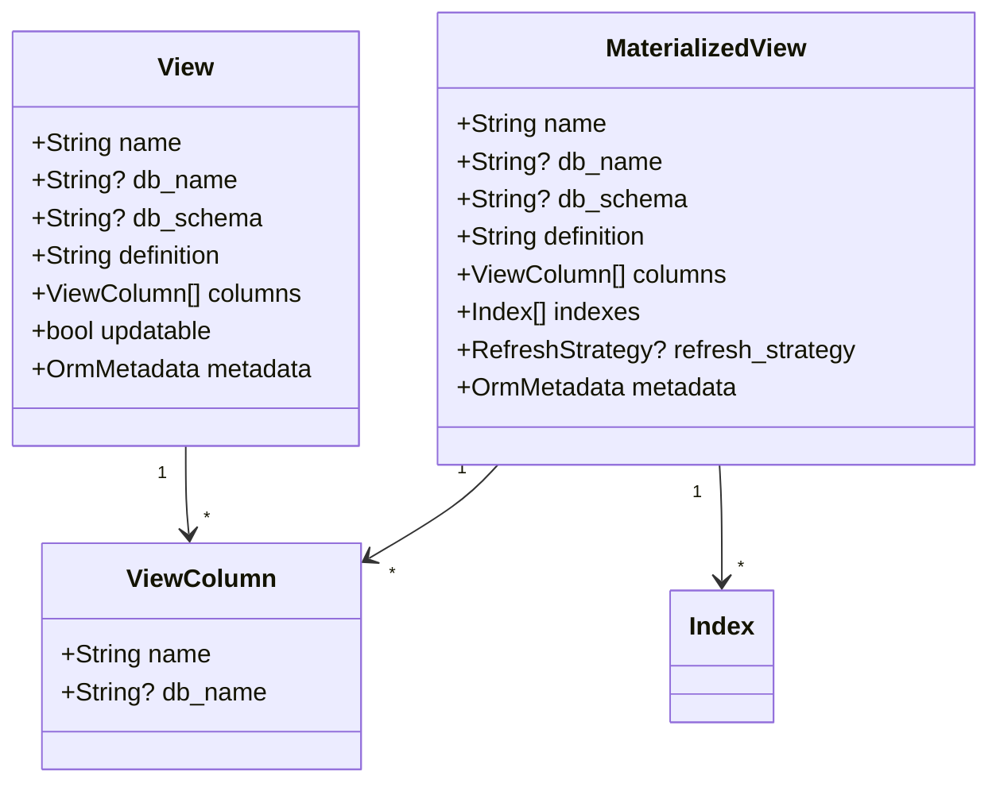

`View.definition` holds the SQL `SELECT` — for Prisma views specifically this is an empty
string, because Prisma Schema Language doesn't expose the underlying query, only the
column list. `MaterializedView` additionally carries `indexes` (materialized views have
physically stored data, so they can be indexed) and a `refresh_strategy`
(`Manual` / `Concurrent` / `Complete`).

## Serialization: canonical JSON

`Schema::to_canonical_json()` produces **pretty-printed JSON with alphabetically sorted
keys**, regardless of the order fields are declared in the Rust structs:

```rust
pub fn to_canonical_json(&self) -> Result<String, serde_json::Error> {
    let value = serde_json::to_value(self)?;      // routes through serde_json::Value
    serde_json::to_string_pretty(&value)           // ...whose object entries are a BTreeMap
}
```

Routing through `serde_json::Value` (backed by a `BTreeMap`) guarantees alphabetical key
order for free — there is no manual sort step to get wrong. This matters because the pivot
is meant to be committed to git: a single column addition should produce a small, readable
diff, not a reshuffled blob because of struct field reordering. This property is directly
covered by the `canonical_json_has_sorted_keys` test in `src/pivot/mod.rs`.

Minimal example — an empty PostgreSQL schema:

```json
{
  "compositeTypes": [],
  "database": "postgreSql",
  "dbSchemas": [],
  "dialectVersion": null,
  "enums": [],
  "extensions": [],
  "functions": [],
  "materializedViews": [],
  "pivotVersion": "1.0.0",
  "procedures": [],
  "sequences": [],
  "tables": [],
  "triggers": [],
  "views": []
}
```

Note every field is `camelCase` — all pivot types derive `#[serde(rename_all =
"camelCase")]` — and the keys above are alphabetically ordered exactly as they'd appear on
disk.

`Schema::from_json(&str)` is the inverse; `Schema` derives `PartialEq`, so
`from_json(to_canonical_json(&schema)) == schema` for every schema — this exact round-trip
is asserted by `schema_round_trips_through_json` and, on a realistic multi-table schema, by
`parse_full_test_schema` (using `test.prisma` at the repo root as the fixture).

## Pivot versioning

`Schema.pivot_version` is a semantic version for **the IR format itself**, independent of
the CLI's own version. `Schema::new()` currently sets it to `"1.0.0"`. When a new ORM
requires enriching the IR in a way that breaks existing serialized pivots (renaming a
field, changing an enum's shape, etc.), `pivot_version` must be incremented and a migration
path provided for schemas serialized under the old version — the same discipline as a
database migration, but for the IR.

## End-to-end: Prisma import pipeline

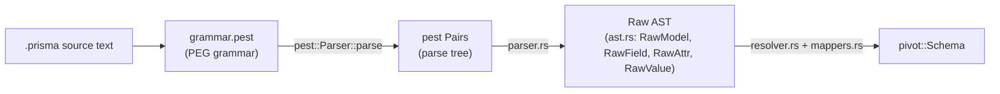

1. **`grammar.pest`** — the PEG grammar defining Prisma Schema Language: `datasource`,
   `generator`, `model`, `enum`, `view`, and `type` alias blocks, plus attribute syntax
   (`@id`, `@@map(...)`, `@relation(...)`, function-call values like `sort: Desc`).
2. **`parser.rs`** — walks the `pest` parse tree (`Pairs<Rule>`) and turns it into the
   loosely-typed `ast.rs` structures (`RawModel`, `RawField`, `RawAttr`, `RawValue`) — this
   stage does not yet know what a `String` or a `@db.VarChar` *means*, it just captures the
   syntax.
3. **`resolver.rs`** (using `mappers.rs` for individual type/attribute translations) —
   resolves the raw AST into the pivot: matches field types against known model/enum names
   to build `Relation`/`ForeignKey` pairs, inlines `type` aliases, and turns each `RawAttr`
   into pivot concepts (`Behavior`, `DbHint`, `DefaultValue`, ...) or, if unrecognized, an
   `OrmMetadata.unknown_features` entry.

See [`importers.md`](importers.md) for the full breakdown of this pipeline and how to add
a new importer following the same pattern.
